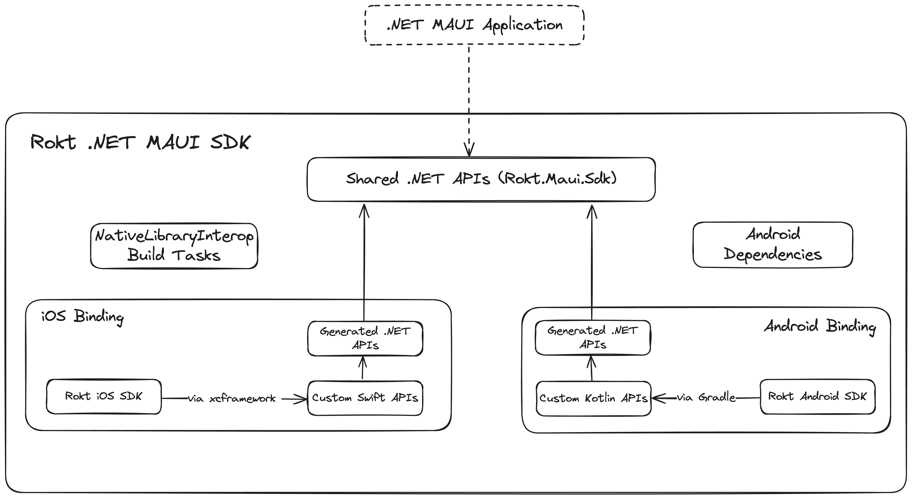

# Architecture

## SDK Overview

### Native Library Interop

The SDK depends heavily on the Native Library Interop build tools from the .NET
Community Toolkit. You can check it out [here](https://github.com/CommunityToolkit/Maui.NativeLibraryInterop).  
The SDK consists of bindings for iOS and android which are consumed by mutual APIs to be consumed
by the host application. More details on these bindings can be found in the [development documentation](./development.md).

### Shared .NET APIs

These APIs (located in the Rokt.Maui.Sdk namespace) are how consuming applications can interact with
the native Rokt mobile SDKs. They expose similar interfaces to those found in the native SDKs, particularly
pertaining to initializing and executing the SDK.

#### Embedded Views

Embedded views are supported via a Maui View Control. You can read more about how this works [here](https://learn.microsoft.com/en-us/dotnet/maui/user-interface/handlers/create?view=net-maui-8.0).

#### Events

Event streams from the native SDKs are supported via .NET APIs. They are supported via Channels which are written to via
a callback passed to the native SDKs. The channel can then be read via the exposed `RoktEvents()` function which returns
an `IAsyncEnumerable<RoktEvent>` which the host app can use asynchronously.
